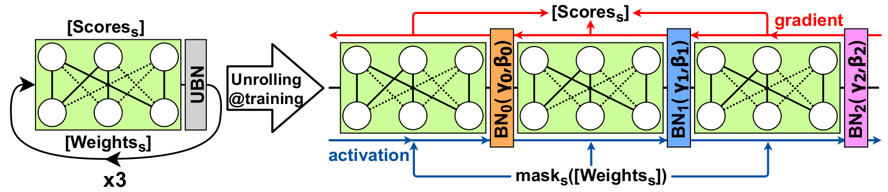

# <em>Hidden-Fold Networks (HFN)</em>: Random Recurrent Residuals Using Sparse Supermasks

by Ángel López García-Arias, Masanori Hashimoto, Masato Motomura, and Jaehoon Yu

Accepted at The British Machine Vision Conference (BMVC) 2021.

arXiv link (coming soon)

<p align="center">

</p>

Code developed originally from a fork of [hidden-networks](https://github.com/allenai/hidden-networks).  
Original/modified files have a signed Apache License 2.0 header.

## Requirements
Python 3.6 or higher. CUDA 11.0.  
For library requirements see ```requirements.txt```.

## Usage
Experiment configurations are defined in yaml files under ```configs/```.  
These configurations can be overridden by setting parameters directly through arguments (see ```args.py```).

### Example 1: HFN-ResNet50, <em>top-k%</em>=30%, CIFAR100
```bash
python3 main.py --config configs/CIFAR100/HFN_ResNet50_3_4.yaml --multigpu 0
```

### Example 2: HFN-ResNet50, <em>top-k%</em>=50%, CIFAR100, 100 epochs
```bash
python3 main.py --config configs/CIFAR100/HFN_ResNet50_3_4.yaml --multigpu 0 --top_k=0.5 --epochs 100
```